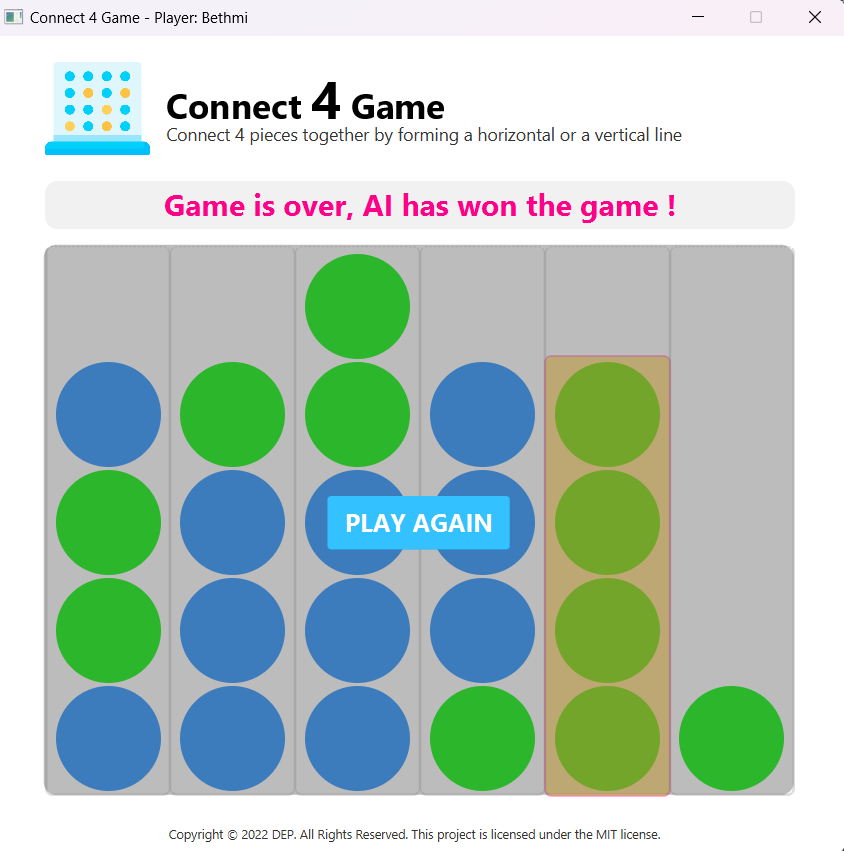

# 🧩 Connect Four Game

This project is a Connect Four game developed using Java and JavaFX. It showcases Object-Oriented Programming (OOP) concepts by allowing one player to play against a computer opponent. The computer's moves are generated using an algorithm, providing a challenging experience for the player.

## Technology Stack:
 ```markdown
✅Java
✅JavaFX
 ```
## Key Features:
- Single Player Mode: Play against the computer.
- Algorithmic Opponent: The computer opponent uses an algorithm to make moves, ensuring a competitive game.
- User-Friendly Interface: The game features a simple and intuitive UI built with JavaFX.


